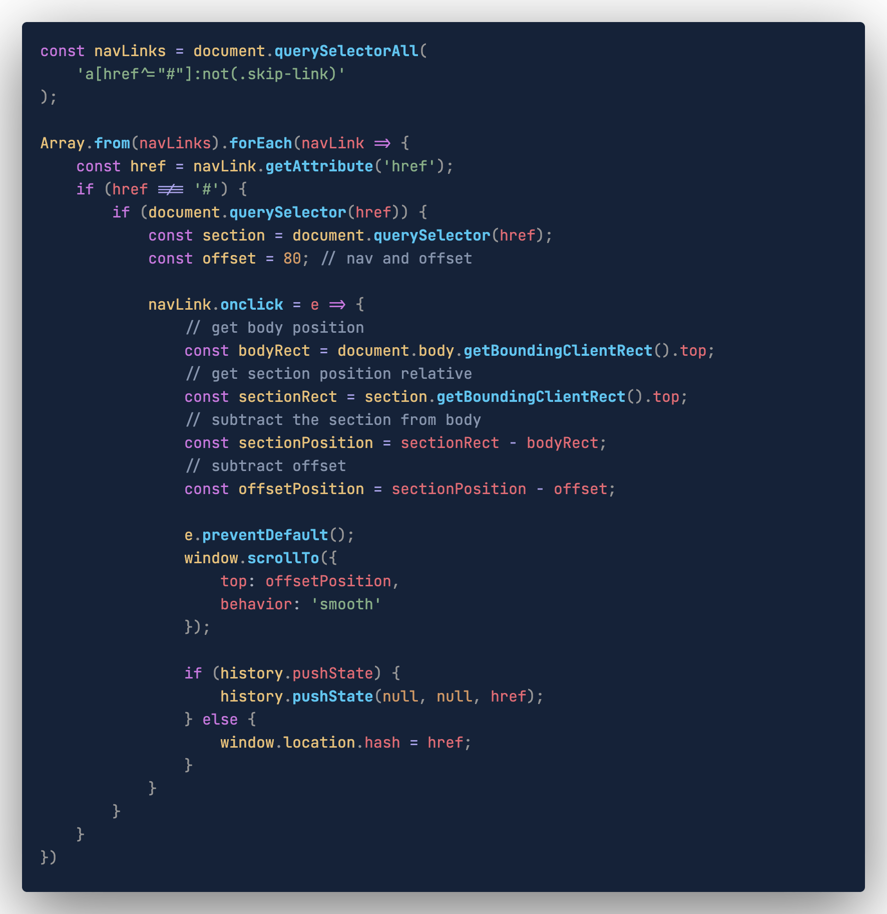
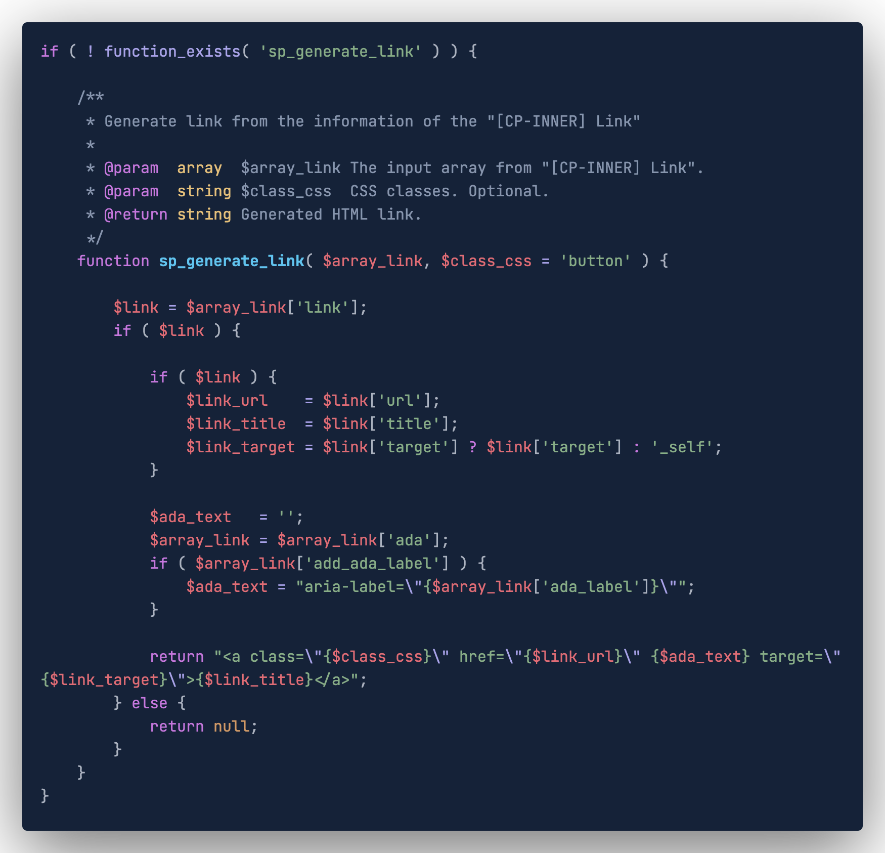

# Deep Dark Color Theme

El tema Deep Dark Color es un diseño meticuloso desde cero, utilizando una cuidadosa combinación de azules oscuros para lograr coherencia visual y centrarse especialmente en lo que más importa: el código. Se basa en la paleta de resaltado de código de [One Dark Pro](https://binaryify.github.io/OneDark-Pro), el cual es fantastico; solo se realizaron algunos ajustes para perfeccionar la experiencia.

## Variaciones

El tema fue concebido originalmente con una paleta de colores azules como punto de partida, junto con colores de acento diseñados para mejorar la accesibilidad en general. Esta constituye la base para otras variaciones, aunque es posible que no todas estén completamente optimizadas.

### Blue

### Purple

### Teal

## Syntaxis

### HTML/PHP

### Javascript

### PHP

### CSS

## Installation

1. Open Visual Studio Code.
2. Go to the Extensions tab (Ctrl+Shift+X).
3. Search for "Blue Dark Color."
4. Install the theme and select "Blue Dark Color" in the color preferences.

Elevate your coding experience with Blue Dark Pro! Download it now and experience a new level of elegance in your development environment.
